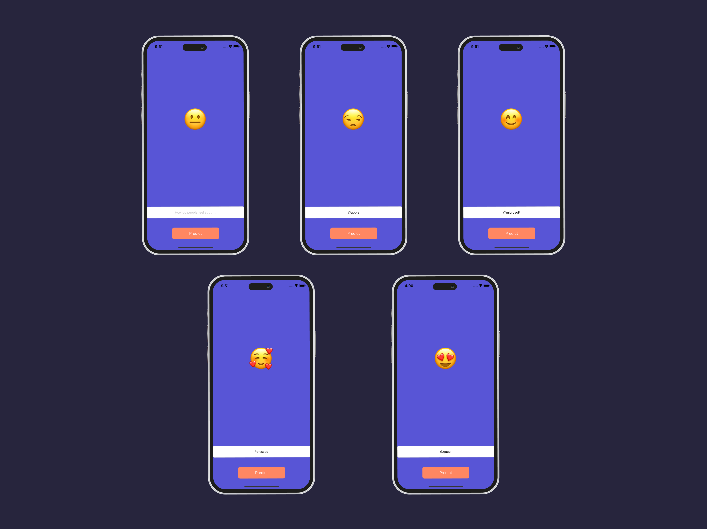
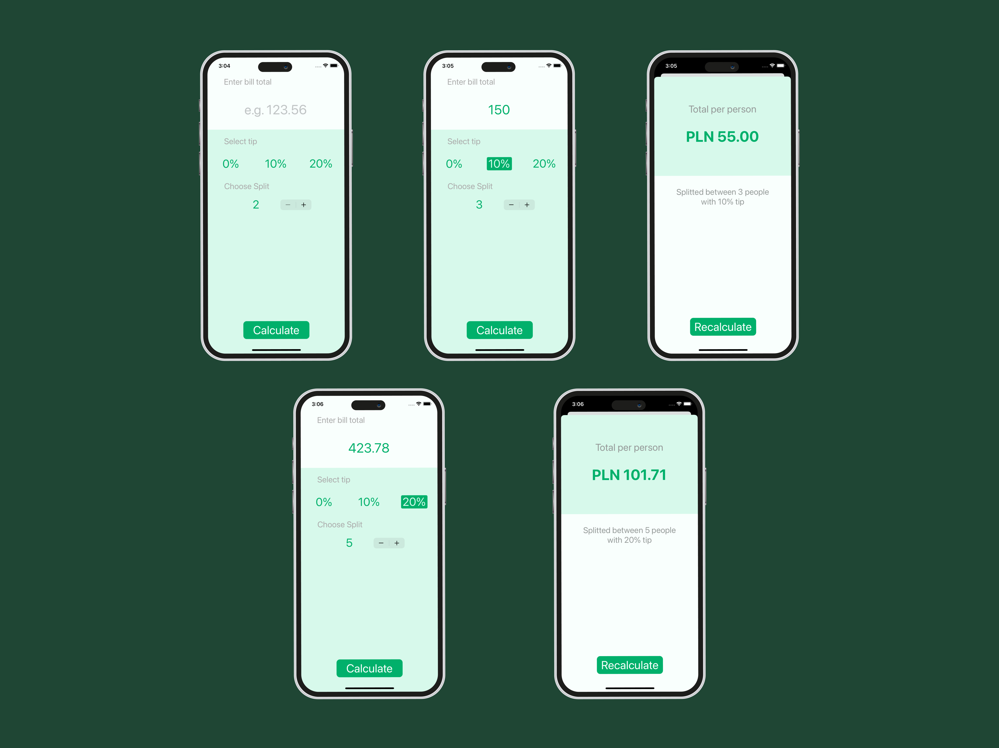

# iOS Developer Portfolio
Hi! I'm Misha and I'm a Sowtware developer. This is my iOS portfolio :)

The structure of this portfolio is a list of the projects I've done during my path through coding. I'm also adding short descriptions, technologies used, and extra notes to some projects in this list.

## Hungry - an Intermittent Fasting App

Hungry helps you to lose weight in the most efficient way - intermittent (or interval) fasting. Some of the core possibilities of the app are:
<ul>
  <li>Fasting Tracker - choose your interval and track fasting and eating period</li>
  <li>Weight Tracker - set starting and goal weight, update current weight and track progress to chosen goal. Weight changes also available in a form of a Chart and a Progress Table</li>
  <li>Water Tracker - set daily water goal and track your consumption, water progress resets every day</li>
  <li>Challenges - choose the one you like, pick a period for it, and try to complete it. Give up option included</li>
  <li>Leveling system - to earn levels and unlock new titles simply use the app - stay in chosen fasting period, track water, complete challenges, etc. </li>
  </ul>

#### ⚙️ Technologies 
<ul>
  <li>UIKit</li>
  <li> Cocoa Touch (gesture recognizers)</li>
  <li> <a href="https://github.com/danielgindi/Charts">Charts</a></li>
  <li><a href="https://github.com/roberthein/TinyConstraints">TinyConstrains</a></li>
  <li><a href="https://github.com/saoudrizwan/Disk">Disk</a></li>
  <li><a href="https://github.com/calimarkus/JDFlipNumberView">JDFlipNumberView</a> obj-c library</li>
  <li><a href="https://github.com/SwiftValidatorCommunity/SwiftValidator">SwiftValidator</a></li>
  <li><a href="https://github.com/devicekit/DeviceKit">DeviceKit</a></li>
  <li>Rewritten <a href="https://github.com/sukov/WaveProgressView">WaveProgressView</a> library</li>
  <li><a href="https://github.com/KyoheiG3/DynamicBlurView">DynamicBlurView</a></li>
  <li>Push Notifications</li>
</ul>
  
Design was applied with Storyboards, Auto-Layout and programmaticaly 

#### 💡 Notes
This one is the current flagman solo-developed project of mine available on the AppStore. The app requires no account creation to use it, also it's totally free, no paid features included. 
The idea was to create a user-friendly fasting app with all the necessary functions plus some extra ones and make it free to easen the fasting process for the newcomers

#### 🔎 Preview

## Stocks Prediction App with Twitter API and CoreML

The app helps you to get the current positive or negative involvement of Twitter users into the chosen topic. Just write a brand name after the "@" symbol or a hashtag after the "#" symbol and the machine learning model under the hood will calculate a score and return it to you in a form of emoji

#### ⚙️ Technologies 
<ul>
  <li>UIKit</li>
  <li> Twitter API v2</li>
  <li> CoreML</li>
  <li><a href="https://github.com/SwiftyJSON/SwiftyJSON">SwiftyJSON</a></li>
</ul>

#### 💡 Notes
For this project, I also used currently deprecated framework - Swifter. I needed a single method so it was possible with some fixes. MLModel used - "tweetModel"

#### 🔎 Preview

## Weather App with Weather API and CoreLocation

Simple app which allows user to get actual weather data. The user's geo and dark mode supported

#### ⚙️ Technologies 
<ul>
  <li>UIKit</li>
  <li> Weather API</li>
  <li> CoreLocation</li>
  <li> Networking (URLSession + JSONDecoder)</li>
</ul>

#### 🔎 Preview

## ToDo App with Realm

All the necessary functionality for a ToDo app with a colorful gradient design

#### ⚙️ Technologies 
<ul>
  <li>UIKit</li>
  <li>Realm</li>
  <li><a href="https://github.com/SwipeCellKit/SwipeCellKit">SwipeCellKit</a></li>
</ul>

#### 💡 Notes
During the development of this app at some point I switched from CoreData to Realm to learn and compare both tools

#### 🔎 Preview

## Bill + Tip split App 

Just a calculator! Insert your total bill, choose the number of people to share between, add a tip percentage if you want, and receive the amount of money each of you has to pay. Currency localization supported

#### ⚙️ Technologies 
<ul>
  <li>UIKit</li>
</ul>

#### 💡 Notes
Everybody starts with classics, simple calculator for simple needs

#### 🔎 Preview

## Contact me

##### Telegram - <a href="https://www.t.me/allwellnow">@allwellnow</a>

##### LinkedIn - <a href="https://www.linkedin.com/in/mishademidenko/">Misha Demidenko</a>

##### Mail - awnisbackwork@gmail.com 
